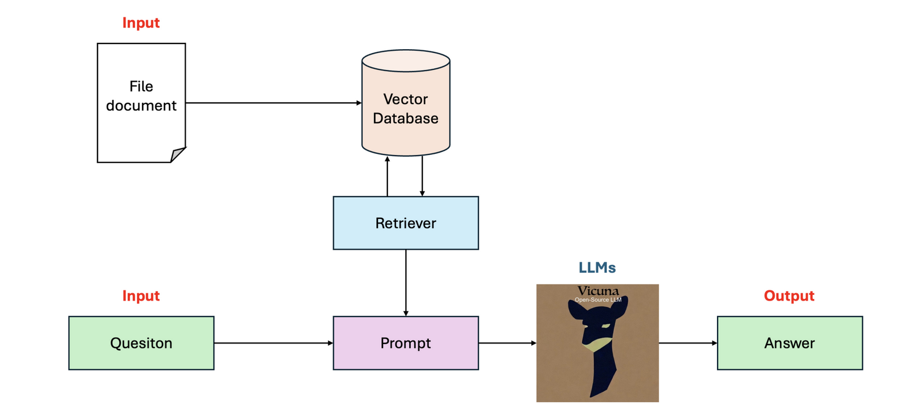
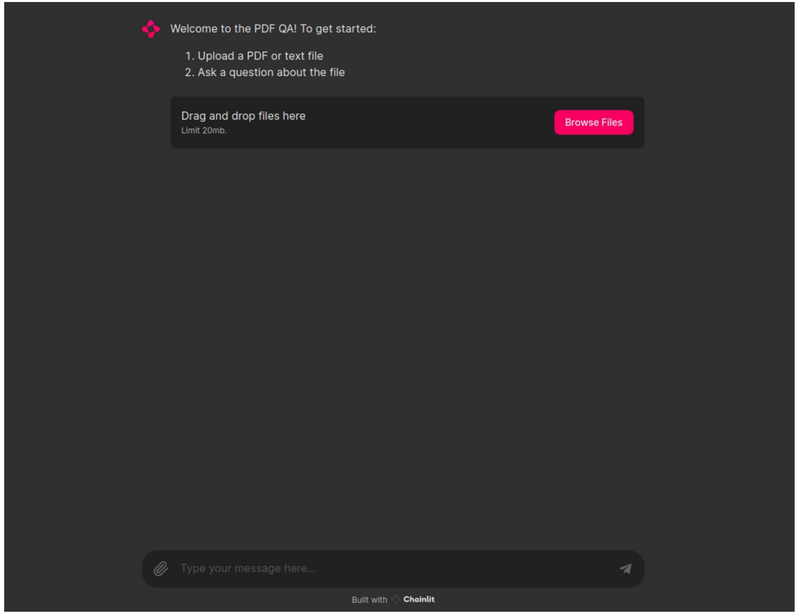

# LLM-RAG

## Description

This is a project about Question Answering for PDF files with LLMs using RAG.
## Technologies 
- Langchain, Chainlit, ChromaDB, Vicuna model

## Pipeline



## Interface



## How to run
1. Install dependencies
```bash
pip install requirements.py
```
2. Run chainlit app
```bash
chainlit ./app/app.py -w
```
